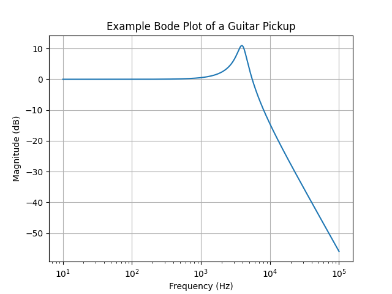
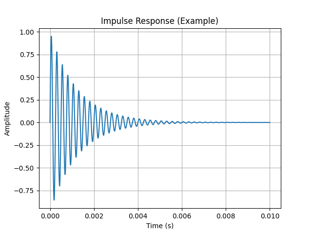

For the last four days, I've been sitting almost nonstop at a very strange intersection of disciplines — somewhere between physics, electrical engineering, and music.

I was writing a program.
Not a plugin.
Not an effect.
But a **physical simulation of a guitar pickup**.

And during this process, I realized something that surprised even me:

> Every pickup has a soul.
> And that soul does not live in words like "warm," "glassy," or "aggressive."
> It lives in a handful of numbers.

---

## Why "describing sound with words" always bothered me

When I first entered the pickup world through the **Sirius Sound** project, I stepped into a culture where everything is explained by ear.

— "This one sings"
— "That one is more open"
— "Here you get more air"

I'm not a musician.
I'm an engineer.

And I kept wanting to ask a very simple question:

**What is actually happening physically?**

What changes when:
- you add more turns?
- you switch wire gauge?
- you change coil geometry?
- you plug in a different cable?

Workshops teach you *how to wind*.
They rarely teach you *why it sounds the way it does*.

---

## Two parameters where character lives

Once the simulation started producing real curves, everything collapsed into two axes:

### 1. Resonant frequency
### 2. Q factor

Together, they define the curve that is essentially a **portrait of a pickup's soul**.

---

## Frequency response and resonance

Here is a typical **Bode plot** — output amplitude versus frequency:

The resonant peak almost always sits **inside the audible range**.
That is not an accident.
That is the reason pickups *have character* at all.

- 2–3 kHz — thick, dark, heavy
- 4–6 kHz — balanced and musical
- 7–9 kHz — glassy, sharp, airy

But frequency alone is only half the story.

---

## Q factor — the sharpness of personality

The Q factor defines **how narrow and sharp the peak is**.

- Low Q → smooth, calm, almost neutral
- High Q → strong personality, "vocal" quality, sometimes aggressive

Two pickups may share the same resonant frequency —
and still sound **completely different** because of Q alone.

---

## Time domain: dynamics and response

Sound is not just frequency.
It is also **time**.

Here is an example impulse response:

From this graph alone you can see:
- how fast the system reacts
- whether it rings
- how quickly that ringing decays

And suddenly it becomes clear:
- why some pickups feel "fast"
- why others feel "soft" or "compressed"
- why attack can feel different even with similar frequency curves

---

## What simulation gives you

The biggest discovery for me was **predictability**.

With this model, I can:
- predict where resonance will move
- see the effect of cable capacitance and pots
- evaluate transient response
- compare designs *before* anything is wound

This does not kill the magic.
It gives the magic a shape.

---

## Final thoughts

I still respect the ear.
Deeply.

But now I also have eyes.

And that feeling —
when sound stops being mystical and becomes understandable, elegant physics —
is incredibly inspiring.
