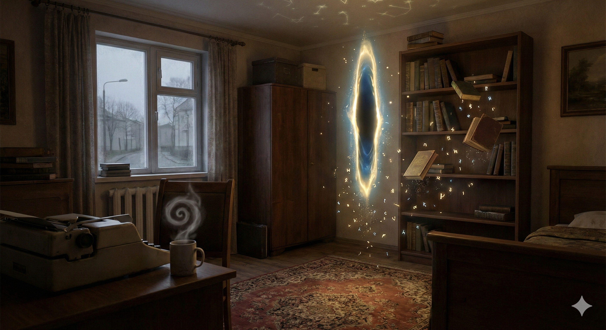
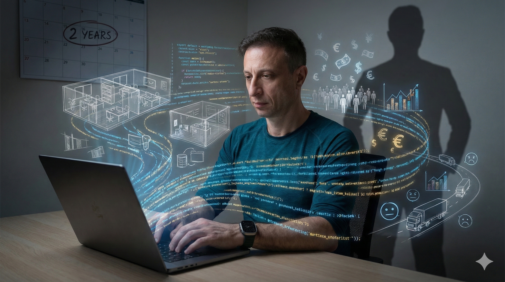
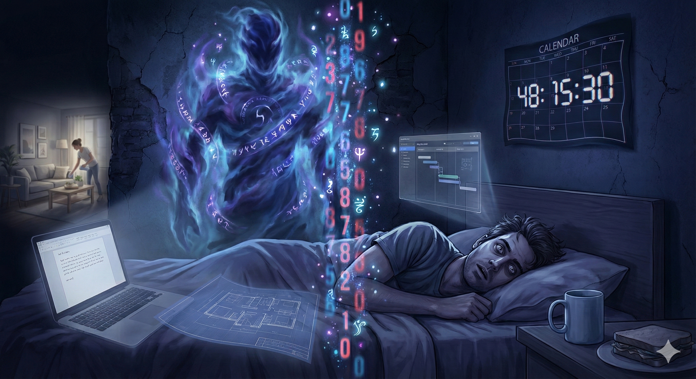

## 48. Точка старта

Сегодня мне 48.
Не юбилей, не круглая дата, не повод для пафоса.
Но внутри это ощущается как очень четкая черта, после которой начинается двухлетний отсчет.

У меня есть простое желание:
за эти два года сменить роль. Перестать быть человеком, который в анкете пишет "программист", и стать человеком, который спокойно говорит "я предприниматель". Не потому что так звучит красивее, а потому что это будет правдой.

Не хочу больше работать только в чужих системах.
Хочу создавать свои.

## Как в дом случайно попала магия

Я полюбил программирование в шестом классе.

В тот год дома совершенно случайно появился компьютер и, к моему удивлению, остался. В то время и в том месте это было почти чудом. Черный ящик, внутри которого живет непонятный мир, который можно менять, если знать правильные слова.

Тогда мне казалось, что код это заклинания.
Пишешь их, нажимаешь Enter, и мир по ту сторону экрана перестраивается. Не улицы и дома, не реальность за окном, а этот второй мир, цифровой. Но ощущение от этого было очень физическое: я могу вмешаться и изменить.

С тех пор я и жил в этой логике.
Есть задача, есть язык, есть структуры данных. Ты садишься и творишь. И результат, как ни странно, ощущается реальнее, чем многие вещи вне экрана.

## Serious Sound и открытие о творении

Потом в жизни появился Serious Sound.
Стартап, в который я попал как основатель.
Там я впервые по-настоящему ощутил, что создание кода это только один из видов создания.

Можно творить не только программы.
Можно творить компании, продукты, команды, смыслы.
Можно собирать из людей, идей, железа, денег и хаоса нечто такое, что начинает жить отдельной жизнью.

Я понял одну вещь, от которой уже не могу отмахнуться:
самое большое удовольствие в жизни для меня это творение.

Что угодно:
код, деталь, устройство, стих, рисунок, музыка, бизнес.

В каждом акте создания есть маленький кусочек чего-то очень большого. Как будто тебе разрешают на секунду приподнять край занавеса и заглянуть в секрет, ответа на который у нас нет, и даже вопросы к нему мы пока формулируем как-то криво. Но ощущение от этого момента абсолютно ясное: да, здесь есть что-то настоящее.

## От кода к сущностям

Почти всю жизнь я создавал одним инструментом, кодом.
И вдруг обнаружил, что мне интересно создавать сущности другого уровня: стартапы, бизнесы, продукты, которые должны жить не только на GitHub, но и в мире, где есть налоги, клиенты, человеческие настроения и случайность.

Такие системы намного сложнее любой программы.
В них есть люди, деньги, рынок, логистика, привычки, страхи и надежды. Слишком много того, что не влезает ни в один тип данных.

Пока у меня получается так себе.
Есть идеи, есть наброски, есть запуски и недозапуски.
Но нет еще той устойчивой конструкции, про которую можно честно сказать: "Вот, это мой бизнес, он живет".

Зато у меня теперь есть рамка.
Два года.

Два года на то, чтобы перестроить свою роль в собственной жизни. Хочу, чтобы к 50 я говорил не "я работаю программистом там-то", а "я делаю вот эти вещи, вот эти стартапы, вот это строю, вот это запускаю".

По сути, хочу сменить не просто профессию.
Хочу сменить идентичность.

## Проблема номер один: время

Все это героически разбивается о простую вещь.
О время.

Мне хронически не хватает часов в сутках.
Идей слишком много, процессов слишком много, обязательств тоже. Я хочу успеть больше, чем физически пролезает в календарь одного человека.

Да, я, скорее всего, взял на себя слишком много.
Но бросить что-то уже не могу.
Каждый проект это кусок меня самого. Каждая идея это попытка еще раз прикоснуться к той самой магии творения.

Появился AI. И честно:
он дал мне огромный рывок вперед.
Стало возможным делать больше, быстрее, глубже.

Но есть побочный эффект.
Чем быстрее ты можешь делать, тем больше хочешь сделать.
И разрыв между "хочу" и "успел" никуда не исчезает. Иногда кажется, что он даже растет.

## Таймер за спиной

В какой-то момент у меня появилось очень устойчивое ощущение:
где-то за спиной стоит некто и считает цифры в обратном порядке.

Я не знаю, от какого числа он начал.
Не знаю, сколько там осталось.
Знаю только, что счет идет назад.

Возможно, это и называется взрослением.
Когда календари перестают восприниматься как линейка вперед и превращаются в таймер, который тикает внутри. Не громко, но достаточно, чтобы иногда просыпаться среди ночи.

Я действительно часто просыпаюсь.
Лежу и думаю, что спать это роскошь. Что прямо сейчас я мог бы сделать хоть один маленький шаг туда, куда хочу. Дописать документ. Сформулировать идею. Допридумать архитектуру. Сдвинуть вперед хотя бы один свой проект.

Иногда я забываю поесть.
Иногда день разваливается на куски задач и списков, а про базовые вещи для организма вспоминаю только в конце.

В более спокойной версии будущего у меня, наверное, есть хаускипер.
Человек, который периодически возвращает меня в мир, где существуют дом, еда, порядок и бытовая реальность. Когда с финансами станет более устойчиво, я почти наверняка к этому приду. Потому что дом, кстати, действительно съедает много времени.

## Дом, который оказался правильным

В этом году я переехал.
И это одно из самых тихих, но важных событий.

Мне нравится мой дом.
Мне нравится район, тишина, воздух, то, как свет ложится утром. Мне нравится место, где я сейчас живу, и то, как я в него вписался.

На фоне всех этих отсчетов, планов, тревог и задач есть одна простая радость: я правда люблю точку на карте, которую сейчас называю домом.

Это ощущается как правильный фундамент.
Если уж бежать свой двухлетний забег, то отсюда.

## Два года

Итак, мне 48.
Это не финал, не вершина и, скорее всего, не середина. Никто не знает, где у него середина.

Для меня это старт.

Старт двухлетнего эксперимента:
можно ли за разумный срок перевести жизнь из режима "работаю на кого-то" в режим "строю свое". Не в фантазиях, не в заметках, а в конкретной реальности.

Я правда не знаю, получится ли.
Знаю только, что очень хочу попробовать.
И что этот внутренний таймер в голове щелкает сейчас особенно громко.

## Неожиданная концовка

Когда я начал писать этот текст, мне казалось, что я фиксирую старт. Как будто жизнь делится на "до" и "после", а этот пост это такая торжественная кнопка "начать отсчет".

Но пока я писал, случилась одна простая мысль, которая слегка выбила почву из-под ног.

Я уже предприниматель.

Не в идеальной картинке, не в будущем через два года, а прямо сейчас.
Потому что предприниматель это не человек, у которого все получилось.
Это человек, который не может перестать что-то придумывать и пытаться это запустить, даже если времени не хватает, даже если страшно, даже если пока не летит.

Я уже живу так, как будто делаю свое.
Я уже ночью просыпаюсь не из-за чужих дедлайнов, а из-за своих идей.
Я уже думаю про бизнесы, продукты и сущности, а не только про задачи в чужом бэклоге.

Двухлетний отсчет никуда не исчез.
Я все так же хочу к 50 прийти к более самостоятельной, устойчивой, финансово понятной жизни.

Но неожиданная концовка в другом:
эта история начинается не сегодня.
Она уже давно идет.

А 48 это не "пора бы стать кем-то другим".
Это спокойное признание:
я уже стал, просто теперь нужно догнать самого себя делами.
