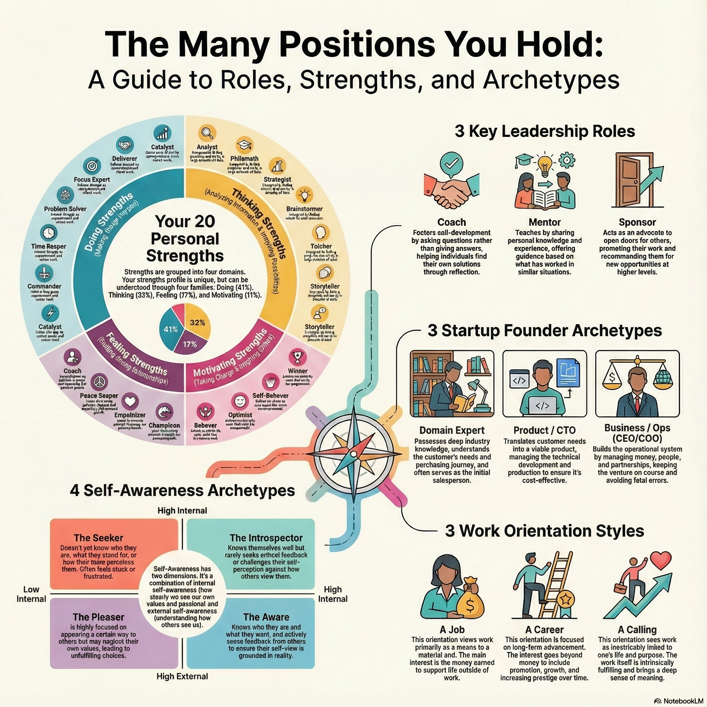

I'm currently studying in the iMBA program, and recently a friend asked me to help her assemble a new team.
To do that, I went back to my notes on leadership, teaming, and psychological safety — and realized these notes had evolved into a coherent set of principles about how teams really function.

What you're reading below is essentially my own distilled learning.
And based on these principles, I also created an application called **[Team Synergy Analytics](https://teamsynergy-composition-analysis-540582499585.us-west1.run.app/)**, which helps analyze team dynamics and understand how a new member might affect the whole system. I'll share the link separately.

## Your Greatest Strengths Are Also Your Biggest Traps

Leadership advice often says: "lean into your strengths."
But unmanaged strengths become liabilities.

Using the **HIGH5 Strengths Test** (link: https://high5test.com/), I identified five core strengths: Analyst, Focus Expert, Time Keeper, Problem Solver, and Philomath.

Each one is valuable — but each one has a shadow:

- **Analyst →** risk of overanalysis and decision paralysis
- **Focus Expert →** risk of rigidity, tunnel vision
- **Time Keeper →** risk of controlling behavior
- **Problem Solver →** risk of pessimism and excessive critique
- **Philomath →** risk of learning endlessly instead of acting

Self-awareness is not "knowing your strengths."
It is understanding how those strengths can sabotage you when they run unchecked.

---

## To Unlock Your Potential, Work With Your Opposites

We naturally surround ourselves with people like us. It feels efficient, predictable, comfortable.
But that comfort is exactly what limits growth.

The surprising finding from the HIGH5 results (again: https://high5test.com/) is that the best collaborators often come from the *bottom* of your strengths list — people whose dominant traits compensate for your blind spots.

Examples:

- The **data-driven Analyst** needs intuitive, people-aware partners (e.g., Empathizers, Optimists).
- The **single-minded Focus Expert** needs adaptive thinkers (Chameleons) who navigate change with ease.
- The **structure-oriented Time Keeper** needs innovative disruptors (Brainstormers) to stretch beyond routine.

This is a practical blueprint:
**cognitive diversity, not similarity, is the real engine of team performance.**

---

## Intrinsic Motivation Is the Engine of Creativity — and Many Leaders Accidentally Kill It

Teresa Amabile's research at Harvard shows that creativity thrives on *intrinsic motivation* — interest, curiosity, challenge — not external pressure.

Yet many organizations unintentionally suppress it:

- **Mismanaged freedom:** giving "autonomy" while constantly shifting goals
- **Mismanaged deadlines:** fake or impossible timelines that erode trust
- **Mismanaged encouragement:** layers of evaluation or premature criticism that kill experimentation

Leaders don't need to "motivate" people like circus trainers.
They need to protect the natural motivation that's already there.

Remove the obstacles, and creativity appears.

---

## Self-Awareness Is a Superpower, and Almost No One Has It

Research shows that only **10–15%** of people are truly self-aware.

There are two kinds:

- **Internal self-awareness:** knowing your values, patterns, triggers, impact
- **External self-awareness:** knowing how others actually perceive you

They are not correlated.
A person can understand themselves deeply yet still be blind to how they affect others.

That's why leadership is a *social* act.
Growth depends on finding "loving critics" — people who support you but also dare to tell you the uncomfortable truth.

---

## Leadership Is Not a Role — It's the Skill of "Teaming"

Amy C. Edmondson's work reframed modern leadership for me.
Stable, well-designed teams are becoming rare. People assemble, disband, recombine constantly.

**Teaming** is the real skill:
collaborating dynamically, learning quickly, operating without a fixed blueprint.

Leadership becomes:

- less a title,
- more a moment-to-moment practice,
- shaped by curiosity, inquiry, and enabling others to solve problems.

Leadership is a verb, not a noun.

---

## Psychological Safety Isn't About "Being Nice"

Psychological safety is the belief that you won't be punished for speaking up with ideas, concerns, questions, or mistakes.

Many leaders confuse it with being pleasant, agreeable, or avoiding conflict.

But Edmondson clarifies:

> Psychological safety is not about comfort.
> It's about candor paired with high expectations.

A team grows when:

- failures are openly examined,
- mistakes turn into "valuable failures,"
- accountability and safety coexist.

The goal is not to make pressure disappear.
It's to create a climate where learning overrides fear.

---

## Teams Aren't Machines — They're Weather Systems

Traditional management treats teams as mechanical: predictable, linear, decomposable.

In reality, teams are **Complex Adaptive Systems (CAS)** — dynamic, nonlinear, emergent.

Like weather:

- small early interactions produce outsized long-term effects
- tone, trust, and early habits create irreversible trajectories
- control is limited, influence is everything

Your role is less "commanding" and more **shaping the climate** where positive emergent properties — trust, agility, curiosity, learning — arise naturally.

---

## Leading From a Place of Curiosity

Across all these ideas, one theme kept showing up: **curiosity is the foundation of effective leadership.**

Curiosity shifts the posture from:

- knowing → learning
- predicting → exploring
- controlling → influencing
- reacting → reflecting

Curiosity dissolves ego and replaces it with awareness.
It turns mistakes into data.
It turns disagreements into discovery.
It turns a group of individuals into an adaptive system capable of evolving.

The most valuable question a leader can ask is simple:

**"What small action can I take tomorrow that will make this team more curious than it was today?"**

Because curiosity isn't a mindset.
It's a culture.
It's a climate.
And it's the condition under which teams truly thrive.

---

